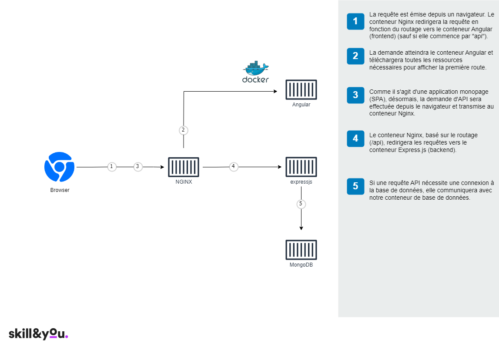

# MEAN (Stack) utilisant Docker


### À propos (MongoDB - Express - Angular - NodeJS)

Le stack **MEAN** - composé de MongoDB, Express, Angular et NodeJS - forme la base d'une application web full-stack. Ce projet sert de point de départ idéal pour en créer une. Le projet démontre également une approche réalisable pour faire fonctionner une application en direct sur **Docker** dans des environnements de développement et de production. Il utilise également **Github actions** pour construire et télécharger des images sur Docker Hub.

Voici l'architecture de l'application lorsqu'elle est en cours d'exécution.



## Évaluation Docker pour le Projet MEAN

### Objectif de l'Évaluation

Votre tâche est de compléter le [Dockerfile](dockerfile) fourni pour construire et configurer une application MEAN. Ce Dockerfile est divisé en instructions numérotées que vous devez compléter. Vous trouverez le Dockerfile dans la racine du projet.

### Instructions

Les instructions détaillées sont fournies dans le Dockerfile. Suivez-les attentivement et complétez les parties manquantes.

### Critères de Correction

Votre Dockerfile sera évalué sur les critères suivants :

- Exactitude des commandes Docker
- Structure et organisation du Dockerfile
- Fonctionnalité de l'image Docker finale

### Ressources

Vous êtes encouragé à effectuer des recherches indépendantes pour compléter cet exercice. L'utilisation de ChatGPT pour des solutions directes est interdite.

## Pour un démarrage rapide

Clonez le dépôt, naviguez jusqu'au dossier racine et exécutez `docker-compose -f 'docker-compose.nginx.yml' up`

```bash
  git clone https://github.com/Skill-You/docker_mean.git
  cd docker_mean 
  docker-compose -f 'docker-compose.yml' up
```

## Dossiers du projet

Les applications écrites dans les frameworks/librairies JavaScript suivants :

| dossier          | Description                                                                                  |
| --------------- | -------------------------------------------------------------------------------------------- |
| **frontend** | [app frontend utilisant **Angular**](/frontend)         |
| **api** | [api utilisant **expressjs**](/backend) |
| **loadbalancer** | [load balancer utilisant **nginx**](/loadbalancer) |
| **mongo** | [configuration de l'image mongo db](/mongo) |

## À propos du projet

L'application web présentée ici est simple mais fonctionnelle. Elle comprend une page d'inscription et de connexion entièrement opérationnelles, ainsi qu'une démonstration complète des fonctionnalités **CRUD** (Créer, Lire, Mettre à jour, Supprimer) qui incorpore le routage Angular et des exemples d'utilisation de l'API REST avec Express.js. De plus, les services REST sont sécurisés en implémentant des **JWT** (Jetons Web JSON) pour une sécurité renforcée.

### Construit avec

#### Angular (16.0.1)

La partie frontend de ce projet est construite avec Angular, qui représente le "A" dans MEAN stack. Pour activer le rendu côté serveur (SSR), nous avons choisi d'utiliser l'image Alpine de Node.js au lieu d'une image Docker légère comme Nginx pour exécuter l'application Angular.

Le projet inclut des exemples de code pour diverses fonctionnalités, telles que :

- Inscription d'utilisateur
- Connexion
- Gestion de profil
- Exemple complet de CRUD

De plus, il y a des exemples de code pour implémenter une garde d'authentification, des services, des intercepteurs HTTP, des résolveurs et une authentification JWT.

#### Expressjs (4.17.1)

Dans le MEAN

 stack, E représente Expressjs, tous les services REST sont développés en utilisant express js.

Il contient des exemples pour :

1. Connexion MongoDB et validation de schéma avec Mongoose
2. Mise en œuvre JWT pour l'autorisation
3. Routage de l'API
4. APIs d'inscription et de connexion d'utilisateur
5. Exemple complet de CRUD

#### Mongo DB

Nous utilisons MongoDB pour la base de données. MongoDB est un programme de base de données orienté documents et multiplateforme. Classifié comme un programme de base de données NoSQL, MongoDB utilise des documents de type JSON avec des schémas optionnels.

**[Script de données initiales](/mongo/init-db.d/01.Seed.sh)**
**[Script de création d'utilisateur de base de données](/mongo/init-db.d/02.Users.sh)**

#### NGINX

_Remarque : seulement si vous utilisez docker._

Nous avons utilisé NGINX comme équilibreur de charge dans le cas où le frontend et l'api doivent être exposés sur le même port.
 Pour la configuration, veuillez vérifier [nginx.conf](/loadbalancer/nginx.conf)

## Pour commencer

### Utilisation de Docker

#### Prérequis

Installez la dernière version de [Docker Desktop](https://www.docker.com/products/docker-desktop)

#### Mode de production

  Pour le mode de production, il y a 2 options :

##### Utilisation de 2 conteneurs (Express (frontend et api) et Mongo)

  ```bash
    git clone https://github.com/Skill-You/docker_mean.git
    cd docker_mean
    
    docker-compose -f 'docker-compose.yml' up
  ```

  ou exécutez simplement ci-dessous car docker considère le nom de fichier par défaut 'docker-compose.yml'

  ```bash
    docker-compose up
  ```

  Cela exécutera le frontend et l'api sur `http://localhost:3000`. Vous pouvez également accéder à mongodb sur le port 27017

#### À propos du fichier Docker Compose

L'objectif principal de ce projet est de montrer la manière possible de faire fonctionner une application réelle (Mean stack) en utilisant docker.

Nous avons considéré 3 scénarios :

1. **Utilisation de 2 conteneurs** ([docker-compose.yml](/docker-compose.yml))

    - express : Pour héberger le Frontend (Angular) et le backend api (expressjs) ensemble
    - base de données : Pour héberger MongoDB

  _Remarque : Si dans le cas ci-dessus nous utilisons MongoDB comme service géré, nous n'aurons besoin que d'un seul conteneur._

```dockerfile
version: "3.8" # spécifier la version de docker-compose

# Définir les services/conteneurs à exécuter
services:
  express: #nom du deuxième service
    build: # spécifiez le répertoire du Dockerfile
      context: .
      dockerfile: dockerfile
    container_name: mean_angular_express
    ports:
      - "3000:3000" #spécifiez les ports de transfert
      # Ci-dessous, les variables d'environnement de la base de données pour l'api sont utiles lorsque vous devez utiliser la base de données comme service géré
    environment:
      - SECRET=Thisismysecret
      - MONGO_DB_USERNAME=admin-user
      - MONGO_DB_PASSWORD=admin-password
      - MONGO_DB_HOST=database
      - MONGO_DB_PORT=
      - MONGO_DB_PARAMETERS=?authSource=admin
      - MONGO_DB_DATABASE=mean-football
    links:
      - database

  database: # nom du troisième service
    image: mongo:latest # spécifiez l'image pour construire le conteneur
    container_name: mean_mongo
    environment:
      - MONGO_INITDB_ROOT_USERNAME=admin-user
      - MONGO_INITDB_ROOT_PASSWORD=admin-password
      - MONGO_DB_USERNAME=admin-user1
      - MONGO_DB_PASSWORD=admin-password1
      - MONGO_DB=mean-football
    volumes:
      - ./mongo:/home/mongodb
      - ./mongo/init-db.d/:/docker-entrypoint-initdb.d/
      - ./mongo/db:/data/db
    ports:
      - "27017:27017" # spécifiez les ports de transfert
```

### Sans Docker

#### Prérequis

1. Installer la dernière version de [Node js](https://nodejs.org/en/)
2. Installer Nodemon comme paquet global (Pour exécuter exprerssjs en mode de développement)
   `npm install -g nodemon`
3. Facultatif (Installer Angular CLI
   `npm install -g @angular/cli`)
4. Installer Mongodb localement ou [S'inscrire](https://www.mongodb.com/atlas-signup-from-mlab?utm_source=mlab.com&utm_medium=referral&utm_campaign=mlab%20signup&utm_content=blue%20sign%20up%20button) pour un compte géré gratuit
5. Avant d'exécuter le projet, assurez-vous que vous pouvez vous connecter à MongoDb, vous pouvez utiliser [Robo 3T](https://robomongo.org/download) pour cela.

#### Exécution du projet

Clonez le projet et exécutez `npm install` dans les dossiers frontend et api.

```bash
  git clone https://github.com/Skill-You/docker_mean.git

  cd docker_mean/frontend

  npm i

  npm start 

  cd docker_mean/backend

  npm i

  npm start 

```

Pour passer les variables d'environnement (détails de la base de données) dans l'api, naviguez jusqu'au dossier api, **renommez `.env.example` en `.env`** et mettez à jour vos détails mongo db là-bas.

  Vous pouvez également exécuter `npm run dev-server` depuis le dossier frontend pour exécuter le frontend et l'api ensemble.

Cela exécutera l'Api sur `http://localhost:3000` et le frontend sur `http://localhost:4200`

## Feuille de route

Consultez les [problèmes ouverts](https://github.com/Skill-You/docker_mean/issues?q=is%3Aissue+is%3Aopen+sort%3Aupdated-desc) pour une liste des fonctionnalités proposées (et des problèmes connus).

## Contribuer

Les contributions rendent la communauté open source un endroit incroyable pour apprendre, s'inspirer et créer. Toutes les contributions que vous faites sont _grandement appréciées_.

1. Forkez le projet
2. Créez votre branche de fonctionnalités (`git checkout -b feature/AmazingFeature`)
3. Committez vos changements (`git commit -m 'Add some AmazingFeature'`)
4. Poussez vers la branche (`git push origin feature/AmazingFeature`)
5. Ouvrez une demande de pull

## Licence

[MIT](https://github.com/Skill-You/docker_mean/blob/main/LICENSE/)

## Contact

  Skill & You - [Site Web](https://www.skillandyou.com)
