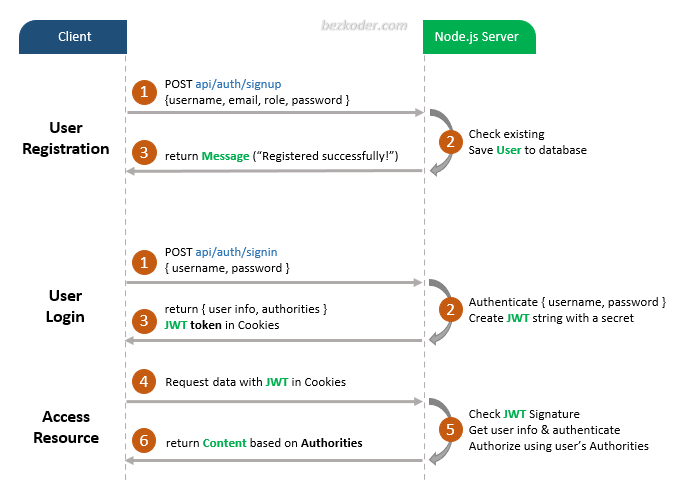

# Exemple de Connexion et d'Inscription Node.js Express avec MongoDB et JWT

- Flux approprié pour la Connexion et l'Inscription des Utilisateurs avec JWT et Cookies
- Architecture Node.js Express avec CORS, middlewares d'Authentification & Autorisation, et Sequelize
- Comment configurer les routes Express pour travailler avec JWT
- Comment définir les Modèles de Données et l'association pour l'Authentification et l'Autorisation
- Méthode d'utilisation de Sequelize pour interagir avec la Base de Données MySQL

## Processus d'Inscription des Utilisateurs, de Connexion et d'Autorisation

Le diagramme montre le flux de notre mise en œuvre du processus d'Inscription des Utilisateurs, de Connexion et d'Autorisation.



## Configuration du Projet

Pour mettre en place votre projet, ouvrez un terminal et exécutez la commande suivante. Cette commande va installer toutes les dépendances nécessaires pour que votre projet fonctionne correctement.

```bash
npm install
```

### Exécution

Pour démarrer l'application, utilisez la commande suivante dans votre terminal. Cette commande va lancer votre serveur Node.js et permettra à votre application de commencer à fonctionner.

```bash
node app.js
```
